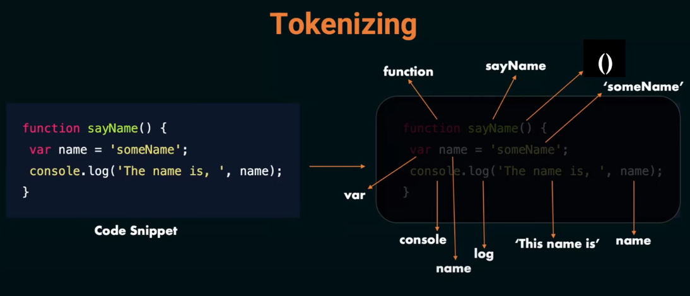
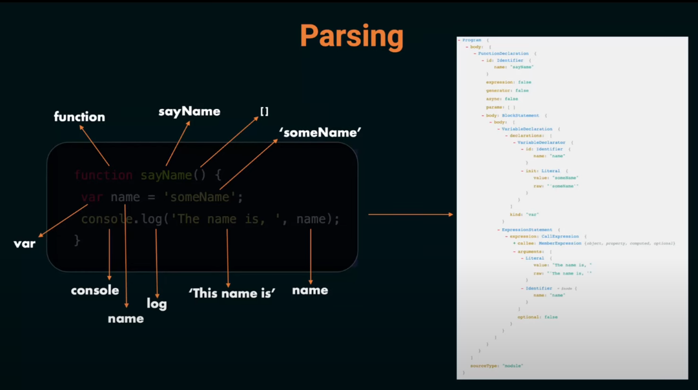
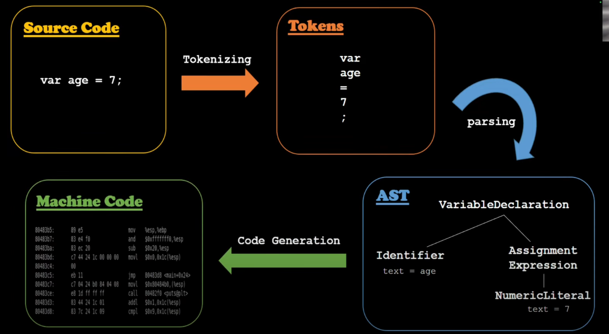

### ✅ Pass by Value vs Pass by Reference

#### 🔹 Primitive Data Types are *Passed by Value*
- ➤ When you copy or pass them to a function, a **new copy** is made.
- ➤ Changing one **does not affect** the other.

#### 🔹 Non-Primitive Data Types are *Passed by Reference*
- ➤ When you copy or pass them, you’re sharing the **same memory address**.
- ➤ So, if you change one, the **original also changes**.

**Primitive Data Types:**

- `String` – Text values (`"Hello"`)
- `Number` – Numeric values (`25`, `3.14`)
- `Boolean` – True/False (`true`, `false`)
- `Undefined` – A variable declared but not assigned (`let x;`)
- `Null` – Represents "nothing" (`let y = null;`)
- `BigInt` – Large numbers (`BigInt(12345678901234567890)`)
- `Symbol` – Unique identifiers (`Symbol("id")`)

**Non-Primitive (Reference) Data Types:**

- `Object` – Collection of key-value pairs
- `Array` – Ordered list of values
- `Function` – Code that can be executed

## stack vs Heap

- Primitive Data Types (like number, string, boolean) are stored in the Stack.

  - ➤ These are small, simple values.

- Non-Primitive Data Types (like object, array, function) are stored in the Heap.
  - ➤ Only a reference (or memory address) is stored in the stack, which points to the actual data in the heap.-

# 🧠 How JavaScript Sees the Code

## 🚦 Steps of Execution:

1. **Tokenizing**  
   - JavaScript breaks the code into small pieces called **tokens** (like words, symbols, etc.).
   

2. **Parsing**  
   - The engine checks the syntax and converts tokens into a **tree-like structure** called the **Abstract Syntax Tree (AST)**.
   

3. **Interpreting**  
   - JS starts understanding and preparing the code to run.

4. **Code Generation**  
   - Finally, the code is converted into **machine code** that your computer can execute.

   

---

## 🔍 How it works (in simple words):

- When we give code to the JavaScript engine, it first **breaks it into tokens** to check if all syntax and keywords are correct.
- After tokenizing, it moves to the **parsing phase**, where the code is turned into a **tree-like structure** called the **Abstract Syntax Tree (AST)**.
- Once parsing is done, the engine **generates machine code** from the AST so it can be executed by the browser.

🔗 Try viewing AST here: [https://astexplorer.net/](https://astexplorer.net/)

